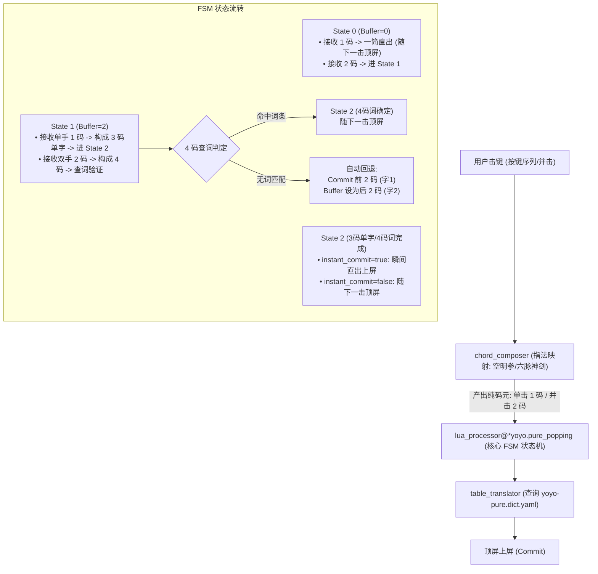

# 麓鸣纯形并击统一架构设计方案 (Unified Pure Shape Architecture)

> 日期：2026-08-24 · 状态：设计与审议中 (In Grilling)

## 1. 背景与核心问题

麓鸣现行的纯形分支（`yoyo-bm-km` 北冥 与 `yoyo-wx-km` 无相）分别代表“单字优先”与“主词优先”两种取向。
- **痛点**：由于在 `chord_composer`（物理并击层）使用「是否并击空格」来硬性分流字与词，导致：
  - 北冥打词时，前两码与后两码必须连续同时并击空格；
  - 无相打单字时，前两码与第 3 码必须带空格并击或单手慢速串击；
  - 无论选哪个方案，用户均需承担大拇指高频并击空格的物理惩罚与手脑协调负担。

## 2. 架构目标

1. **彻底消除空格并击**：无论是打单字（一简、两码、三码全码）还是打词语（四码定长），**全程 0 空格并击**。
2. **上下文感知状态机（FSM）**：将字词分流下沉至 `popping.lua` 深模块，依据输入缓冲区（Preedit Buffer）长度精准决策输入意图。
3. **保留 6638 字零重码优势**：第 3 码依然通过左手区（`⿰/⿺` 左右/左下包围结构）与右手区（其他结构）实现 3 码零重，但单手击键无需再按空格。
4. **词典去语法化**：剥离词典中 `[ ]`、`-`、`=` 等物理控制符，回归规范语义码。

## 3. 实施切片与 GitHub Issues (Ticket Breakdown)

- 🎯 **父级 Spec**：[Issue #28](https://github.com/JackTheMico/yoyo/issues/28)
- 🎫 **Ticket 1 (#29)**：[feat(纯形): 生成与校验纯形规范词典 (yoyo-pure.dict.yaml)](https://github.com/JackTheMico/yoyo/issues/29) `(Frontier · 可立即开始)`
- 🎫 **Ticket 2 (#30)**：[feat(纯形): 实现 pure_popping.lua 上下文感知状态机处理器与单元测试](https://github.com/JackTheMico/yoyo/issues/30) `(Blocked by #29)`
- 🎫 **Ticket 3 (#31)**：[feat(纯形): 构建 yoyo-pure-km 与 yoyo-pure Schema 并打通端到端击键链路](https://github.com/JackTheMico/yoyo/issues/31) `(Blocked by #30)`
- 🎫 **Ticket 4 (#32)**：[feat(纯形): 更新文档、发布脚本与反查数据生成适配](https://github.com/JackTheMico/yoyo/issues/32) `(Blocked by #31)`

---

## 4. 决策日志 (Decision Log)

### 决策 1（已决）：方案命名与共存策略
- **结论**：采用 **独立新方案（Option B）**。
- **方案标识**：
  - `yoyo-pure-km.schema.yaml`（方案名：「麓鸣·纯形·空明」）
  - `yoyo-pure.schema.yaml`（方案名：「麓鸣·纯形·六脉」）
  - `yoyo-pure.dict.yaml`（纯形规范字典）
- **理由**：与既有的 `yoyo-bm` / `yoyo-wx` 并存，便于直接对照测评、验证手感与零破坏回归。

---

### 决策 2（已决）：四码输入未命中词库时的回退机制
- **结论**：采用 **自动切分并顶屏（Option A）**。
- **机制细节**：
  - 当连续两次双手并击形成 4 码 `c1c2c3c4` 时，状态机检测词典 Trie 树：
    - 若命中有效词条 -> 维持 4 码词候选，准备随下一击顶屏；
    - 若未命中任何词条 -> 立即将第 1 击的 `c1c2` 作为单字 1 提交上屏（Commit），并将第 2 击 `c3c4` 重新作为单字 2 进行查找与候选呈现。
- **理由**：保证打单字时的连打流畅度，用户连打单字与打词心智统一，无需任何手动退格或切分符号。

---

### 决策 3（已决）：单字 3 码齐备时的顶屏时机与开关控制
- **结论**：**默认采用选项 A（随下一击顶屏），并提供 schema 配置开关支持选项 B（即刻直出）**。
- **配置开关设计**：
  - 在 `yoyo-pure.schema.yaml` / `yoyo-pure-km.schema.yaml` 的 `switches` 中定义开关：
    ```yaml
    switches:
      - name: instant_commit_3code
        reset: 0  # 0: 随下一击顶屏（默认 Option A）；1: 满3码即刻直出（Option B）
        states: [ 顶屏, 直出 ]
    ```
  - `popping.lua` 根据当前 context 中的 `instant_commit_3code` 选项状态决定是执行 `confirm_current_selection()` 还是立即 `commit()`。
- **理由**：兼顾主流顶功节奏（下一击顶屏）与极限竞速打单需求（3 码即刻直出），将控制权交给用户。

---

### 决策 4（已决）：词典去标记化的实施与同步策略
- **结论**：采用 **独立规范字典（Option A）**。
- **字典标识**：`rime/yoyo-pure.dict.yaml`。
- **编码格式规范**：
  - **单字三码（全码）**：`字 \t c1c2c3 \t 权重`（例如 `的 \t d.O \t 0`、`是 \t wCs \t 0`、`鸣 \t bXn \t 0`）。
    - 结构信息由第 3 码 `c3` 物理键区天然承载（左半键盘对应 `⿰/⿺`，右半键盘对应其他结构），无需在字典中硬编码 `-` 或 `=`。
  - **一简字/词**：`字/词 \t c \t 权重`（例如 `的 \t d \t 92123018`、`有 \t e \t 33869044`），无需 `_` 或 `+` 标记。
  - **二字/多字词**：`词 \t c1c2c3c4 \t 权重`（例如 `可以 \t xkhr \t 0`）。
- **理由**：彻底净化数据模型，旧字典 `yoyo-bm.dict.yaml` 保持原状，确保旧版方案零破坏。

---

## 4. 详细技术实现方案

### 4.1 模块结构与数据流



### 4.2 Schema 配置文件结构

- `rime/yoyo-pure-km.schema.yaml`（空明拳版）：
  - 引入 `yoyo:/空明拳` 指法。
  - 配置 `instant_commit_3code` 开关。
  - 挂载 `lua_processor@*yoyo.pure_popping` 状态机处理器。
  - 标点并击沿用已有无冲突编码（`ser` / `fg` 前缀）。
- `rime/yoyo-pure.schema.yaml`（六脉神剑版）：
  - 引入 `yoyo:/六脉神剑` 指法。

### 4.3 验证计划 (Verification Matrix)

1. **一简验证**：左手/右手单手 1 击直出一简字词，验证 120 个一简字词不受任何影响。
2. **三码单字验证**：
   - 左右结构（如「鸣」`bXn`）：双手 `bX` + 左手 `n`（0 空格），测试能否正确出字并顶屏。
   - 上下结构（如「是」`wCs`）：双手 `wC` + 右手 `s`（0 空格），测试能否正确出字并顶屏。
   - `instant_commit_3code` 开关开启/关闭时的上屏时机对比。
3. **四码词语验证**：连续两次双手并击（如「可以」`xk` + `hr`，0 空格），测试词语上屏。
4. **四码非词回退验证**：连续输入两个不成词的 2 码字（如「红蓝」），测试字 1 是否自动顶屏、字 2 是否进入候选。
5. **标点并击与反查验证**：标点并击（`ser`+选择键）、拼音反查（`` ` ``+拼音）行为完全兼容。

