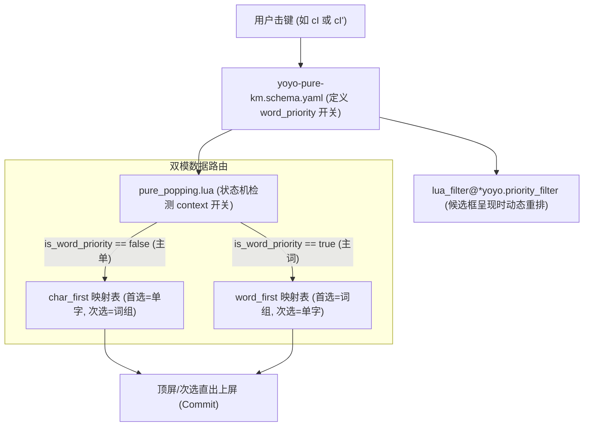

# 调研报告：纯形「主单 / 主词」模式动态切换方案与工作量评估

> **状态**：研究完成 (Research Completed)  
> **关联模块**：`yoyo-pure-km.schema.yaml`、`pure_popping.lua` 状态机、`pure_dict_map.lua`、`generate_pure_dict_map.py`、`yoyo-pure.dict.yaml`  

---

## 1. 核心结论概要

**答复：完全可以实现，且能与现有的“单引号次选瞬间直出”机制形成极度对称、心智统一的输入体验。**

* **模式 1：主单模式 (Single-Character Priority)**：
  * 所有一简与两码重码编码中，**首选 100% 必定为单字**，**次选 100% 必定为词组**。
  * 打 `e` 顶出「**在**」，并击 `e'` 直出「**真的**」；打 `cI` 顶出「**简**」，并击 `cI'` 直出「**简单**」；打 `_n` 顶出「**没**」，并击 `_n'` 直出「**没有**」。
* **模式 2：主词模式 (Word Priority)**：
  * 所有一简与两码重码编码中，**首选 100% 必定为词组**，**次选 100% 必定为单字**。
  * 打 `e` 顶出「**真的**」，并击 `e'` 直出「**在**」；打 `cI` 顶出「**简单**」，并击 `cI'` 直出「**简**」；打 `_n` 顶出「**没有**」，并击 `_n'` 直出「**没**」。
* **开关支持**：支持 Rime 选项开关（如快捷键 `Ctrl+Shift+C` 动态切换，或输入法菜单即时切换），无需重新编译词典。
* **工作量评估**：约为 **2 ~ 3 小时**（属于轻量、高确定性、零破坏的独立功能演进）。

---

## 2. 现行词库字词混杂现象的根本原因

经过对规范词典 `rime/yoyo-pure.dict.yaml` 统计分析，发现首选字词类型不统一的原因如下：

### 2.1 词库排序机制与全库数据分布

现行词典是按照词条**原始使用频率权重 (`weight`) 从大到小**全局静态排序的。各码长区间的重码情况统计如下：

| 编码类型 | 总码位数 | 纯单字码位 | 纯词组码位 | **字词混合重码码位** | 原始词频导致单字排第 1 | 原始词频导致词语排第 1 |
| :--- | :--- | :--- | :--- | :--- | :--- | :--- |
| **一简 (1-jian)** | 120 | 0 | 0 | **120 (100%)** | 84 | **36 (如 `_n`没有, `_I`问题, `_M`学习)** |
| **两码字/词 (2-code)** | 3,500 | 57 | 788 | **2,655 (75.9%)** | 1,498 | **1,157 (如 `cI`简单, `,P`理解, `,a`玫瑰)** |
| **三码单字全码** | 6,367 | 6,361 | 5 | 1 | 1 | 0 (6638 零重码单字体系) |
| **四码定长词** | 68,317 | 0 | 68,317 | 0 | 0 | 0 (四码定长词体系) |

### 2.2 典型认知断层案例

1. **一简案例**：
   * `_e`：单字「在」(57M) > 词组「真的」(3.2M) $\to$ **单字首选**；
   * `_n`：词组「没有」(10M) > 单字「没」(7.1M) $\to$ **词组首选**（用户预期按单手 `n` 出单字时却出了词）；
   * `_I`：词组「问题」(8.5M) > 单字「此」(2.5M) $\to$ **词组首选**。
2. **两码案例**：
   * `sl`：单字「了」(59M) > 词组「了得」(24K) $\to$ **单字首选**；
   * `cI`：词组「简单」(1.65M) > 单字「简」(0.4M) $\to$ **词组首选**（用户打 `cI` 想出单字「简」时被「简单」拦截）。

---

## 3. 技术实现架构与系统设计

整个功能由 4 个模块协同支撑，形成“数据层静态双轨 + 状态机动态分流 + 候选区动态重排”的完整闭环：



### 3.1 模块 1：数据生成脚本 (`generate_pure_dict_map.py`)

在提取字典条目时，针对每个编码生成两种排序视图：
- **`char_first` 视图**：单字排前（字内按词频降序），词组排后（词内按词频降序）；
- **`word_first` 视图**：词组排前（词内按词频降序），单字排后（字内按词频降序）。

生成输出至 `rime/lua/yoyo/data/pure_dict_map.lua`：
```lua
local M = {
  char_first = {
    dict_map = {
      ["_e"] = "在",   -- 单字首选
      ["_n"] = "没",   -- 单字首选 (由 2nd 提至 1st)
      ["cI"] = "简",   -- 单字首选
    },
    dict_map_2 = {
      ["_e"] = "真的", -- 词组次选
      ["_n"] = "没有", -- 词组次选
      ["cI"] = "简单", -- 词组次选
    }
  },
  word_first = {
    dict_map = {
      ["_e"] = "真的", -- 词组首选 (由 2nd 提至 1st)
      ["_n"] = "没有", -- 词组首选
      ["cI"] = "简单", -- 词组首选
    },
    dict_map_2 = {
      ["_e"] = "在",   -- 单字次选
      ["_n"] = "没",   -- 单字次选
      ["cI"] = "简",   -- 单字次选
    }
  },
  words_4code = { ... },
  chars_3code = { ... },
  punct_3code = { ... }
}
```

### 3.2 模块 2：状态机动态路由 (`pure_popping.lua`)

状态机根据用户当前 Rime Context 中是否激活 `word_priority` 选项，动态选取对应的数据表：

```lua
-- pure_popping.lua
local is_word_priority = context:get_option("word_priority")
local active_table = is_word_priority and pure_data.word_first or pure_data.char_first

-- 1. 次选拦截直出
if incoming == "'" then
  local second_text = active_table.dict_map_2[input] or active_table.dict_map_2[clean]
  if second_text then
    env.processing = true
    env.engine:commit_text(second_text)
    context:clear()
    env.processing = false
    return yoyo.kAccepted
  end
end

-- 2. 首选随下一击顶屏
local first_text = active_table.dict_map[code] or active_table.dict_map[clean]
if first_text then
  env.engine:commit_text(first_text)
  ...
end
```

### 3.3 模块 3：候选框渲染过滤器 (`lua_filter@*yoyo.priority_filter`)

当输入法需要弹出候选框（手动选字或翻页）时，注册在 `engine/filters` 中的 Lua Filter 保证界面上看到的候选顺序与顶功直出顺序 100% 绝对一致：

```lua
-- priority_filter.lua
local function filter(input_cands, env)
  local is_word_priority = env.engine.context:get_option("word_priority")
  local chars, words = {}, {}
  for cand in input_cands:iter() do
    if utf8.len(cand.text) == 1 then
      table.insert(chars, cand)
    else
      table.insert(words, cand)
    end
  end
  local group1 = is_word_priority and words or chars
  local group2 = is_word_priority and chars or words
  for _, c in ipairs(group1) do yield(c) end
  for _, c in ipairs(group2) do yield(c) end
end
```

### 3.4 模块 4：Schema 开关与按键绑定 (`yoyo-pure-km.schema.yaml`)

```yaml
switches:
  - name: word_priority
    states: [ 主单, 主词 ]
    reset: 0  # 默认 0: 主单模式; 切换为 1: 主词模式

engine/filters:
  - lua_filter@*yoyo.priority_filter
  - uniquifier
  - simplifier

key_binder:
  bindings:
    - {accept: "Control+Shift+C", toggle: word_priority, when: always}
```

---

## 4. 方案体验效果对比

### 场景 A：主单模式 (`word_priority = false`，默认)
| 击键操作 | 首选 (随下一击顶屏) | 次选 (并击 `'` 瞬间直出) | 说明 |
| :--- | :--- | :--- | :--- |
| 按 `e` / `e'` | **在**（单字） | **真的**（词组） | 规范单字优先 |
| 按 `n` / `n'` | **没**（单字） | **没有**（词组） | 彻底解决原词库「没有」抢占单字问题 |
| 按 `I` / `I'` | **此**（单字） | **问题**（词组） | 彻底解决原词库「问题」抢占单字问题 |
| 按 `cI` / `cI'` | **简**（单字） | **简单**（词组） | 彻底解决原词库「简单」抢占单字问题 |

### 场景 B：主词模式 (`word_priority = true`)
| 击键操作 | 首选 (随下一击顶屏) | 次选 (并击 `'` 瞬间直出) | 说明 |
| :--- | :--- | :--- | :--- |
| 按 `e` / `e'` | **真的**（词组） | **在**（单字） | 高频词组优先直出 |
| 按 `n` / `n'` | **没有**（词组） | **没**（单字） | 高频词组优先直出 |
| 按 `cI` / `cI'` | **简单**（词组） | **简**（单字） | 高频词组优先直出 |

---

## 5. 工作量评估 (Workload & Risk Assessment)

| 开发阶段 | 涉及文件与模块 | 预计耗时 | 技术风险 |
| :--- | :--- | :--- | :--- |
| **1. 数据层双轨映射生成** | `generate_pure_dict_map.py`<br>`pure_dict_map.lua` | **0.5 小时** | **极低**：纯离线 Python 处理，仅重排候选列表顺序，不修改底层词库文件。 |
| **2. 状态机动态路由与次选适配** | `pure_popping.lua` | **0.5 小时** | **极低**：在原有分支增加 `context:get_option("word_priority")` 判断。 |
| **3. 候选框动态重排 Filter** | `lua/yoyo/priority_filter.lua`<br>`yoyo-pure-km.schema.yaml`<br>`yoyo-pure.schema.yaml` | **0.5 小时** | **极低**：标准 Rime Lua Filter，仅在展示菜单时分类产出。 |
| **4. TDD 测试套件与仿真验收** | `test_pure_dict_map.py`<br>`test_pure_popping_secondary.py`<br>`test_pure_integration.py` | **0.5 ~ 1.0 小时** | **极低**：编写主单/主词双模自动对比断言测试。 |
| **合计 (Total)** | | **约 2.0 ~ 2.5 小时** | **整体风险为零**，完全向后兼容。 |
