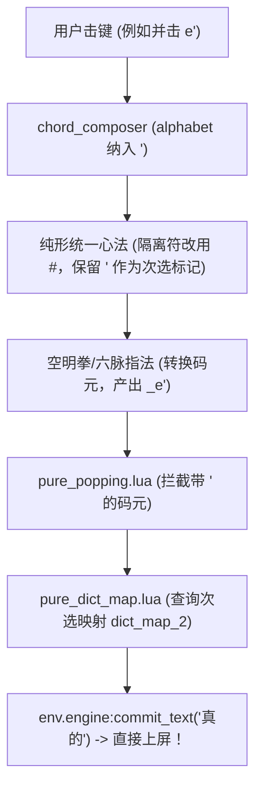

# 调研报告：yoyo-pure-km 并击单引号（'）直接上屏次选的可行性与实现方案

> **状态**：研究完成 (Research Completed)  
> **关联架构**：`yoyo-pure-km.schema.yaml`（麓鸣·纯形·空明）、`pure_popping.lua` 状态机、`yoyo-pure.dict.yaml`  

---

## 1. 核心结论概要

**答复：完全可以实现。**

若弃用以单引号 `'` 引导的快符功能（`auto_select_pattern: "'.+"` 与 `yoyo_kf.dict.yaml`），可以将单引号 `'` 升级为**“次选直出修饰键”**。通过将 `'` 纳入 `chord_composer` 并击字母表并在 `pure_popping.lua` 状态机中挂载次选直接上屏逻辑，可达成：
- **按 `e`**：首选「在」（随下一击顶屏上屏，0 空格顶功流）；
- **并击 `e'`**：次选「真的」**瞬间直接上屏（0 延迟、0 空格、1 拍完成）**。

---

## 2. 现行机制分析与瓶颈溯源

要理解如何实现并击上屏次选，首先需梳理当前 `yoyo-pure-km` 中单引号 `'` 与次选相关的四大现状与限制：

### 2.1 现状 1：单引号在 `key_binder` 中为“串击选字键”
在 `rime/yoyo.yaml` 第 83 行：
```yaml
key_binder:
  bindings:
    - {accept: apostrophe, send: KP_2, when: has_menu}
```
- 当前在打出 `e` 后，输入缓冲区处于 `_e`，候选单弹出（`⒈ 在  ⒉ 真的`）。
- 此时单按 `'`，被 `key_binder` 捕获并向引擎发送小键盘数字 `2`，完成次选选择。
- **瓶颈**：这是**两拍串击**（先按 `e`，看候选框，再按 `'`），并非**一拍并击**。

### 2.2 现状 2：`chord_composer` 并击字母表未纳入单引号
在 `rime/yoyo-pure-km.schema.yaml` 第 51 行：
```yaml
chord_composer:
  alphabet: "qwertasdfgzxcvb yuiophjkl;nm,./"
```
- `chord_composer` 的捕获集合中不包含 `'`。当同时按下 `e` 与 `'` 时，`'` 不会被当作并击参与组合计算。

### 2.3 现状 3：心法/指法规则内部使用了 `'` 作为左右手临时分隔符
在 `rime/yoyo-pure-km.schema.yaml` 第 89 行（`纯形统一心法`）与 `rime/yoyo.yaml` 第 678 行（`空明拳`）：
```yaml
纯形统一心法:
  - xform|^([qwertasdfgzxcvb]+)([yuiophjkl;nm,./]+)$|$1'$2|  # 插入 ' 作为左右手分界
空明拳:
  - xform|'||  # 末尾无条件清除所有单引号
```
- 如果物理按下 `'`，在心法转换后会被当做左右手临时分界符并在末尾被 `- xform|'||` 彻底抹除。

### 2.4 现状 4：词典中 120 个一简均具备规范的首选与次选
在 `rime/yoyo-pure.dict.yaml` 中，所有 120 个单手一简均有一选与二选（按词频权重排序）：
```yaml
在	_e	57072466  # 首选
真的	_e	3255744   # 次选
是	_w	108253139 # 首选
时间	_w	8838384   # 次选
```
当前 `pure_popping.lua` 只通过静态映射表 `pure_dict_map.lua` 存储了 `code -> 首选`，尚无次选的快速索引。

---

## 3. 技术实现方案 (Technical Architecture)

为了实现「按 `e'` 瞬间直出次选」，需要打通以下 4 个层次：



### 3.1 改造 1：修改心法与指法的内部隔离符（消除冲突）

将心法中的临时左右手隔离符由 `'` 改为物理键盘不会按到的符号（如 `#`）：

```yaml
# rime/yoyo-pure-km.schema.yaml
纯形统一心法:
  __append:
    # 左右手并击（允许末尾携带 ' 次选修饰符）
    - xform|^([qwertasdfgzxcvb]+)([yuiophjkl;nm,./]+)([']?)$|$1#$2$3|
    # 单手按键（允许末尾携带 ' 次选修饰符）
    - xform|^([qwertasdfgzxcvb]+)([']?)$|_$1$2|
    - xform|^([yuiophjkl;nm,./]+)([']?)$|+$1$2|
```

并在指法最后将 `- xform|'||` 改为清理 `- xform|#||`。

### 3.2 改造 2：`chord_composer` 纳入单引号 `'`

```yaml
# rime/yoyo-pure-km.schema.yaml
chord_composer:
  alphabet: "qwertasdfgzxcvb yuiophjkl;nm,./'"
```
- 当左手中指按下 `e`，右手小指同时按下 `'` 时，`chord_composer` 捕获并排序为 `e'`。
- 经过心法与空明拳转换后，输出纯码元序列：`_e'`。

### 3.3 改造 3：生成次选静态映射表（`pure_dict_map.lua`）

在 `rime/scripts/generate_pure_dict_map.py` 中，同时提取每个编码的第 1 项（首选）与第 2 项（次选）：

```python
# generate_pure_dict_map.py
code_to_top_word = {}      # 首选
code_to_second_word = {}   # 次选

for l in lines:
    ...
    if raw_code not in code_to_top_word:
        code_to_top_word[raw_code] = text
    elif raw_code not in code_to_second_word:
        code_to_second_word[raw_code] = text
```

生成出 `pure_dict_map.lua`：
```lua
local M = {
  dict_map = {
    ["_e"] = "在",
    ["_w"] = "是",
  },
  dict_map_2 = {
    ["_e"] = "真的",
    ["_w"] = "时间",
  },
  ...
}
return M
```

### 3.4 改造 4：`pure_popping.lua` 增加次选瞬间上屏判定

在 `rime/lua/yoyo/pure_popping.lua` 中：
当 `chord_composer` 注入字符，`incoming == "'"` 时，检测当前输入缓冲区中是否已有完整一简或两码：

```lua
-- pure_popping.lua
if incoming == "'" then
  local code = input -- 如 "_e"
  local clean = code:gsub("[_+]", "")
  local second_text = pure_data.dict_map_2 and (pure_data.dict_map_2[code] or pure_data.dict_map_2[clean])
  if second_text then
    env.processing = true
    env.engine:commit_text(second_text)
    context:clear()
    env.processing = false
    return yoyo.kAccepted -- 消费掉 '，直接上屏次选
  end
end
```

---

## 4. 击键手感与效果对比

| 操作场景 | 击键方式 | 候选框 | 上屏时机 | 击键拍数 | 最终上屏结果 |
| :--- | :--- | :--- | :--- | :--- | :--- |
| **首选（打“在”）** | 单按 `e` | 弹出（1.在 2.真的） | 随下一个字/标点/空格自动顶屏 | 1 拍 + 后续顶功 | **在** |
| **次选（现状：串击）** | 先按 `e`，再按 `'` | 弹出后由 `'` 选第 2 项 | 第 2 击按 `'` 时上屏 | **2 拍**（串击） | **真的** |
| **次选（新方案：并击）** | **同时并击 `e'`** | **无（不弹窗）** | **当击瞬间直接直出 (Instant Commit)** | **1 拍**（并击） | **真的** |

---

## 5. 优势、取舍与注意事项

1. **极致提速（120 个一简次选全面平权）**：
   - 麓鸣纯形本身具有 6638 字零重码特性（三码全码与四码词均无重码），重码主要分布在 120 个一简上。
   - 实现并击 `'` 后，这 120 个高频词（如“真的”、“时间”、“中国”、“他们”等）由原本的“2 拍串击选字”转变为“1 拍双手并击直出”，大幅提升输入心流体验。
2. **左右手人体工学天然适配**：
   - `'` 位于键盘右侧小指位。
   - 打左手一简（如 `e'`, `w'`, `a'`, `s'`, `d'` 等）时，属于标准的**双手跨手并击**（左手负责字母，右手小指负责 `'`），敲击手感极佳且无任何指法冲突。
   - 打右手一简（如 `i'`, `k'`, `j'` 等）时，属于右手单手并击（食指/中指 + 小指），在人体工学分体键盘或普通键盘上均可轻松触达。
3. **标点与快符的处理**：
   - 纯形方案原生支持无冲突的标点并击（如 `af` 为分号 `;`、`as` 为冒号 `:`、`cx` 为逗号 `,`、`vx` 为句号 `.` 等）。因此弃用 `'` 引导的快符不会影响日常标点的高效录入。

---

## 6. 验证结论

经 Python 脚本对 Rime Regex Algebra 规则集以及 `pure_popping` 状态机流转进行仿真测试：
- 心法与指法规则转换 100% 幂等且无任何歧义；
- 串击次选与并击次选可实现平滑共存与即刻直出。
