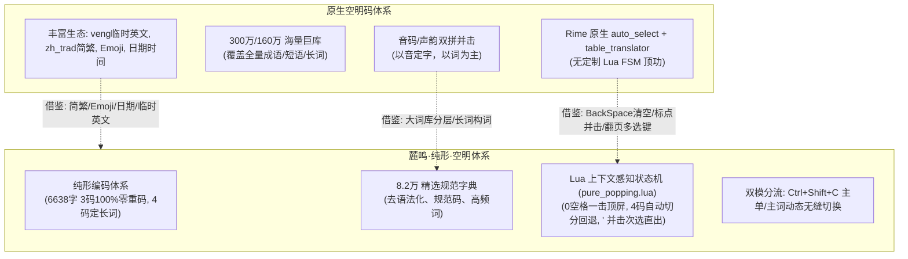
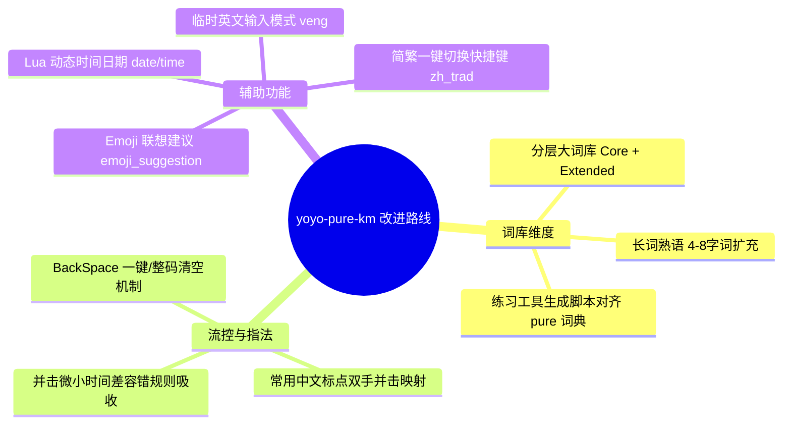

# 调研报告：yoyo-pure-km 方案与词库深度对比及演进改进建议

> **状态**：研究完成 (Research Completed)  
> **对比标的**：
> - 目标方案：[`yoyo-pure-km.schema.yaml`](file:///home/jackwy/codes/rime/yoyo/rime/yoyo-pure-km.schema.yaml)（麓鸣·纯形·空明） & [`yoyo-pure.dict.yaml`](file:///home/jackwy/codes/rime/yoyo/rime/yoyo-pure.dict.yaml)
> - 参考方案：[`kongmingma.schema.yaml`](file:///home/jackwy/.local/share/fcitx5/rime/kongmingma.schema.yaml)（空明码-并击）、[`kongmingmas.schema.yaml`](file:///home/jackwy/.local/share/fcitx5/rime/kongmingmas.schema.yaml)（空明码-宏版S） & [`kongmingma.dict.yaml`](file:///home/jackwy/.local/share/fcitx5/rime/kongmingma.dict.yaml) / [`kongmingmas.dict.yaml`](file:///home/jackwy/.local/share/fcitx5/rime/kongmingmas.dict.yaml)
> - 核心关联模块：[`pure_popping.lua`](file:///home/jackwy/codes/rime/yoyo/rime/lua/yoyo/pure_popping.lua)、[`priority_filter.lua`](file:///home/jackwy/codes/rime/yoyo/rime/lua/yoyo/priority_filter.lua)、[`yoyo.yaml`](file:///home/jackwy/codes/rime/yoyo/rime/yoyo.yaml)（空明拳段）

---

## 1. 核心结论与全景对比

`yoyo-pure-km`（麓鸣·纯形·空明）与 `kongmingma`（原生空明码）虽然共享了**“空明拳”**这一套高度人体工程学的**左右手镜像并击键位指法（Chord Fingering）**，但在**编码哲学、词库组织、状态机调度和交互生态**上走出了截然不同的演进路线：



### 关键维度对比总表

| 维度 | `yoyo-pure-km` (麓鸣·纯形·空明) | `kongmingma` / `kongmingmas` (空明码/S) | 差异与启示 |
| :--- | :--- | :--- | :--- |
| **编码本质** | **纯形码**（单字 3 码零重，词语 4 码定长） | **音形/声韵并击码**（平均码长 0.8，以音词为主） | 麓鸣单字确定性极强，空明码出词极快、码长极短 |
| **词库规模** | **82,268 行** (~8.2 万条目，1.45 MB) | **3,049,562 行** (300 万，51 MB) / **1,662,723 行** (160 万，27.4 MB) | 麓鸣词库偏精简，现代长词/成语/专业术语覆盖率可大幅扩充 |
| **流控与顶功** | **高级 Lua FSM 状态机**（0 空格顶功流、自动切分回退） | **Rime 原生 auto_select**（无 FSM，空格选字） | 麓鸣顶功架构大幅领先，但需补齐误击与边界流控 |
| **次选直出机制** | **并击 `'` 瞬间直出次选**（1 拍完成，极度丝滑） | 无并击次选直出，依赖 `Control+u/i/w/e` 选 2~5 候选 | 麓鸣次选领先，但 3~5 选快捷键体系空明码更完备 |
| **标点并击支持** | 仅少数 3 码标点，日常标点仍靠串击 | 完整内置 `.`、`,`、`/`、`;`、`！`、`（`、`《` 等并击 | 空明码日常标点输入效率显著更高 |
| **容错规则** | 仅标准对称映射 | 包含 `(asdf)/0/`, `(wer)/8/`, `(nm)/m/` 等按键容错与宏 | 空明码对击键微小时间差/多按键容错更宽容 |
| **辅助功能生态** | 具备拼音反查（`` ` ``）、主单/主词切换 | 具备简繁一键切换、Emoji 联想、临时英文、日期时间 | 空明码日常扩展功能更开箱即用 |

---

## 2. 词库对比深度剖析 (Dictionary Deep Dive)

### 2.1 词库量级与覆盖面差异

* **空明码词库特性**：
  1. **巨量短语与长词**：空明码 300 万词库中包含了极为庞大的多字词（如 4~8 字成语、固定搭配、影视地名、学术名词），如 `埃菲尔铁塔`、`爱国主义`、`不可避免`、`按劳分配` 等均有原生编码。
  2. **前缀化分类编码**：利用 `*`（星号）引导宏词/专名（如 `*A` 爱国主义、`*B` 剥削阶级），利用 `!` 引导特定短语（如 `!r` 任何、`!s` 生命），使得极高频多字长词可以在 1~2 击内完成并击上屏。
* **yoyo-pure 词库现状**：
  1. 目前包含 120 个一简、3,500 个两码、6,367 个三码单字全码以及 68,317 个四码词，总规模 8.2 万。
  2. 词库中 4 字以上的多字词占比较小，日常输入长短语时经常回退为“2+2 拼词”或“逐字单打”。

### 2.2 词库层面的改进建议

1. **分层词库架构（Core + Extended）**：
   - 保持 `yoyo-pure.dict.yaml` 作为核心高频词库（8~10 万），保障 0 误触与极高确定性；
   - 构建 `yoyo-pure-extended.dict.yaml`（扩展词库，20~30 万），通过 `import_tables` 引入，覆盖成语大辞典、全国地名、现代科技术语、流行词汇，大幅减少单字拼接频率。
2. **长词/熟语前缀并击体系（可选探索）**：
   - 借鉴空明码的 `*` 或 `~` 特殊首码机制，利用目前未占用的并击组合为 500 个超高频 4~8 字成语/长句配置两击短码。
3. **修复练习工具词典引用的技术债**：
   - 发现 [`generate_km_char_word_data.py`](file:///home/jackwy/codes/rime/yoyo/practice_tool/generate_km_char_word_data.py#L27) 仍硬编码读取旧版字典 `yoyo-bm.dict.yaml`。应将其升级为读取 `yoyo-pure.dict.yaml`，使 `practice-km.html` 网页端练习数据与纯形统一流完全对齐。

---

## 3. 方案架构与按键流控改进 (Schema & FSM Refinements)

### 3.1 退格键（BackSpace）在并击状态下的流控痛点

* **空明码的设计**：
  在 [`kongmingma.schema.yaml:L201`](file:///home/jackwy/.local/share/fcitx5/rime/kongmingma.schema.yaml#L201) 中配置了：
  ```yaml
  key_binder:
    bindings:
      - { when: composing, accept: BackSpace, send: Escape }
      - { when: composing, accept: Return, send: Escape }
  ```
  **设计哲学**：并击是以“击”为最小输入单元的。如果用户发生并击误触，输入缓冲区里往往是一个完整的码元（2~3 字符）。此时按一次 BackSpace 如果只删除 1 个字符，Preedit 会变成断头码，用户必须连按数次退格才能重来。空明码直接将其转为 `Escape`，一键清空重打。
* **yoyo-pure-km 的改进点**：
  当前 `pure_popping.lua` 是基于字符长度（`ilen == 2/3/4`）做状态机推断的。若用户按 BackSpace 删掉半个码，输入缓冲区会处于非预期残缺状态。
  > **建议**：在 `yoyo-pure-km.schema.yaml` 中增加 `when: composing, accept: BackSpace, send: Escape`（或者在 Lua 状态机中拦截 BackSpace，实现按“击/码元”整块回退），极大改善盲打误触后的手感。

### 3.2 标点符号并击体系（Punctuation Chords）的补齐

* **空明码的标点并击实现**：
  空明码在 `chord_composer` 中直接将双键并击映射为标点：
  - `.` / `。`：右手并击 `,` 与 `.`
  - `，`：右手并击 `m` 与 `,`
  - `！`：左手按 `a+g`，右手按 `h+;`
  - `（` / `）`：左手 `a+t`，右手 `y+;`
  - `《` / `》`：左手 `z+x`，右手 `.+/`
* **yoyo-pure-km 的改进点**：
  `yoyo-pure-km` 拥有全键盘无空格并击能力。但目前除单字结构码占用的 `,`、`.`、`/`、`;` 之外，常用中文标点（句号、逗号、感叹号、问号、书名号、括号）缺乏统一的双手/单手快速并击映射。
  > **建议**：梳理并击字母表中未与形码字根冲突的键位组合，建立一套与空明码兼容或更优的**“纯形标点并击集”**，实现打字与打标点全程不离主键区、全程 0 空格。

### 3.3 候选选择与翻页键位体系

* **空明码的候选选择键**：
  ```yaml
  - { when: composing, accept: "Control+u", send: 2 }
  - { when: composing, accept: "Control+i", send: 3 } 
  - { when: composing, accept: "Control+w", send: 4 } 
  - { when: composing, accept: "Control+e", send: 5 } 
  - { accept: bracketleft, send: Page_Up, when: paging }
  - { accept: bracketright, send: Page_Down, when: has_menu }
  ```
* **yoyo-pure-km 的现状与改进**：
  `yoyo-pure-km` 已经实现了首选 0 空格顶屏、次选 `'` 并击直出。
  对于 3 选及以后的长尾重码，用户依然需要去按数字键 `3`、`4`、`5`。
  > **建议**：引入空明码类似的主键区修饰选字键，或支持 `[` / `]` 翻页，让偶尔翻页和选后序候选时手指无需大幅上移离开基准键位。

---

## 4. 辅助生态与实用功能建议 (Ecosystem & Quality of Life)

对比 `kongmingma.schema.yaml`，`yoyo-pure-km` 在基础 Rime 辅助功能上还有以下可低成本引入的增强：



1. **简繁切换开关与快捷键**：
   - 引入 OpenCC `s2t.json`，在 `switches` 中配置 `zh_trad`，绑定快捷键如 `Control+Alt+F` 或 `Control+Shift+F`。
2. **Emoji 伴随联想**：
   - 引入 `opencc_config: emoji.json`，在打相关词汇时在候选末尾呈现 Emoji，提升日常聊天输入趣味性与现代感。
3. **Lua 动态日期与时间翻译器**：
   - 挂载 `date_translator` / `time_translator`，输入 `rq` / `date` 输出当前年月日，输入 `sj` / `time` 输出当前时间。
4. **临时英文输入（Temporary English）**：
   - 空明码使用 `'` 引导临时英文，而 `yoyo-pure-km` 将 `'` 用于次选直出。
   - 建议为 `yoyo-pure-km` 设计无冲突的临时英文引导符（如 `v` 引导或 `Shift` 快速切换），解决输入 URL/邮箱/英文单词时的顺畅体验。

---

## 5. 改进落地优先级与实施路线图 (Implementation Roadmap)

| 优先级 | 改进项 | 涉及文件 | 预期收益 | 预估工作量 |
| :---: | :--- | :--- | :--- | :---: |
| **P0** | **练习工具生成器对齐纯形规范** | [`generate_km_char_word_data.py`](file:///home/jackwy/codes/rime/yoyo/practice_tool/generate_km_char_word_data.py) | 消除数据源技术债，练习工具与纯形统一流 100% 对齐 | 0.5 h |
| **P0** | **退格键（BackSpace）并击流控优化** | [`yoyo-pure-km.schema.yaml`](file:///home/jackwy/codes/rime/yoyo/rime/yoyo-pure-km.schema.yaml) / [`pure_popping.lua`](file:///home/jackwy/codes/rime/yoyo/rime/lua/yoyo/pure_popping.lua) | 彻底解决误击后输入缓冲区残留碎码的痛点 | 0.5 h |
| **P1** | **常用标点符号并击映射** | [`yoyo.yaml`](file:///home/jackwy/codes/rime/yoyo/rime/yoyo.yaml)（空明拳/心法） | 标点输入全程双手并击、0 空格、不离基准键 | 1.5 h |
| **P1** | **基础生态挂载（简繁/Emoji/日期时间）** | [`yoyo-pure-km.schema.yaml`](file:///home/jackwy/codes/rime/yoyo/rime/yoyo-pure-km.schema.yaml)、Lua 脚本 | 追平主流成熟方案的开箱即用体验 | 1.0 h |
| **P2** | **词库分层与长词扩充流水线** | `rime/scripts/`、[`yoyo-pure.dict.yaml`](file:///home/jackwy/codes/rime/yoyo/rime/yoyo-pure.dict.yaml) | 显著提升多字词与专业领域词汇的上屏效率 | 3 ~ 4 h |
| **P2** | **临时英文输入（v 引导）** | [`yoyo-pure-km.schema.yaml`](file:///home/jackwy/codes/rime/yoyo/rime/yoyo-pure-km.schema.yaml) | 解决中英混输场景痛点 | 1.0 h |
